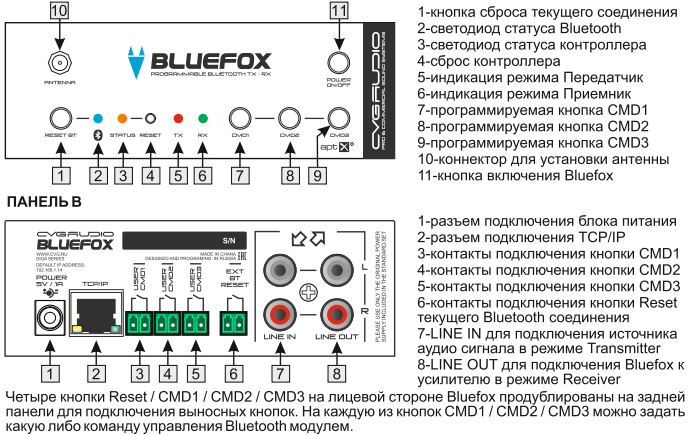

#CVGaudio BLUEFOX

##Оглавление
1. [Общая информация](#Общая_информаци)
2. [Лицевая панель](#Лицевая_панель)
3. [Технические характеристики](#Технические_характеристики)

##Общая информация 

CVGAUDIO BLUEFOX - профессиональный программируемый ВЕИЕТООТН V5.1 приемник
передатчик для использования в составе качественных звуковых систем конференц-залов, офисных
помещений и прочих общественных и частных пространств, где требуется высококачественная
передача/прием звукового сигнала, возможность глубокого программирования системы и тонкой
настройки авторизации. Прибор имеет очень удобный, интуитивно понятный веб интерфейс,
используемый для комплексной настройки, мониторинга работы и управления устройством, Таким
образом вы можете изменить имя Bluetooth сети, изменить или убрать необходимость ввода
при подключении, управлять списком сохраненных парных устройств, организовывать подключение
к устройству с конкретным МАС адресом, разрешить или запретить автоматическое подключение и
много многое другое. Важной особенность CVGAUDIO BLUEFOX является то, что он может быть
настроен и как приемник и как передатчик. Таким образом используя два прибора — можно
организовать беспроводную передачу звукового сигнала от одного BLUEFOX настроенного как
- ко второму BLUEFOX настроенному как приемник. для этого в устройстве
предусмотрены и INPUT для подключения сигнала от внешнего звукового источника, и таюке
OUTPUT для подключения внешнего звукового усилителя. BLUEFOX поддерживает все актуальные
BIuetooth профили (A2DP, AVRCP, SPP, и другие) и протоколы для высококачественной
беспроводной передачи звука (aptX, aptX LowLatency, МРЗ, ААС, SBC). На корпусе CVGAUDIO
BLUEFOX имеются три кнопки на которые можно прописать нужные команды управления модулем.
Все это также делается через устройства. для удобства программирования имеется
удобный конструктор, упрощающий создание и ввод команд. Помимо этого, наиболее используемые
команды можно закрепить на шестнадцати программируемых пользовательских кнопках web-
интерфейса. Bluefox может полнофункционально управляться от внешней системой управления
принимая команды по ТСР/1Р. Причем можно организовать не только управление базовыми
командами типа сброс соединения, перезагрузка, а также и командами для тонкой настройки
переименования, редактирования PlN кода подключения, редактирования сохраненных пар и так
далее. В BLUEFOX используется внешняя, устанавливаемая на корпусе антенна. Это
обеспечивает уверенный прием в прямой видимости до 30 - 40 метров. Стены и прочие преграды
ощутимо уменьшают это расстояние, но в любом случае расстояние уверенного приема сигнала
будет несравнимо больше, чем у устройств с внутренними антеннами. Возможно подключение
выносной опциональной антенны. CVGAUDlO BLUEFOX может использоваться как настольное
устройство или устанавливаться в монтажную стойку. Высота корпуса соответствует 1U. В
стандартный комплект поставки входит кронштейн, который можно зафиксировать на одной из
боковых сторон BLUEFOX и далее фиксировать прибор на одной из стоек рекового шкафа. Блок
питания 5Vj1A входит в стандартный комплект поставки CVGAUDlO ВИИЕРОХ.громкость всех
используемых аудио приборов, проектором, экраном, шторами и светом.

##Лицевая панель 

##Технические характеристики 

<body>
    <h2>HI GEEKSFORGEEKS USER'S</h2>
    <form>
        <input type="button" value="Print"
               onclick="window.print()" />
    </form>
</body>