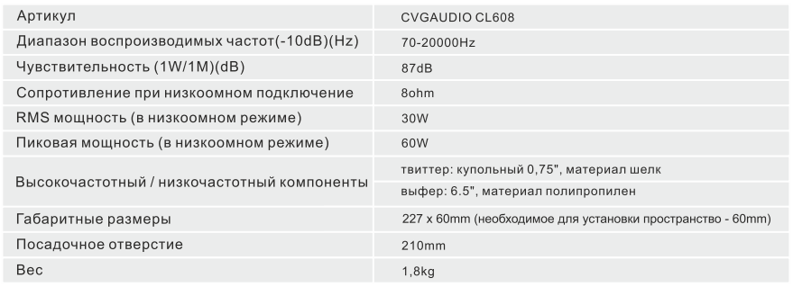

#CVGaudio CL608

##Оглавление
1. [Подключение](#Подключение)
2. [Технические характеристики](#Технические_характеристики)
3. [Гарантийные обязательства](#Гарантийные_обязательства)
4. [Общая информация](#Общая_информация)
5. [Комплект поставки](#Комплект_поставки)
6. [Установка](#Установка)

##Подключение 

Акустические системы CVGaudio CL608 имеют импеданс 80hm. Подавляющее большинство Iow-
impedance усилителей совместно с которыми должны работать акустические системы данного типа
имеют допустимый диапазон нагрузки 4-80hm. Таким образом если Вы планируете подключить к
каждому каналу усилителя несколько акустических систем необходимо контролировать суммарное
сопротивление подключаемой нагрузки. Допустимо использование последовательного и
параллельного подключения акустических систем. При необходимости эти два типа подключения
можно комбинировать. При параллельном подключении двух акустических систем сопротивление
уменьшается в половину, при последовательном - сопротивление складывается.

##Технические характеристики 

##Гарантийные обязательства 

На все акустические системы производства CVGAUDIO предоставляется гарантийный срок
бесплатного сервисного обслуживания - 2 года с момента приобретения изделия конечным
покупателем. При возникновении проблем связанных с работой акустических систем просим Вас
обратится к нашему дилеру у которого приобретался товар или в Московский офис компании
CVGAUDlO. Контакты Вы сможете найти на нашем сайте www.cvg.ru. Для осуществления гарантийного
ремонта необходимо предоставить любой финансовый документ подтверждающий приобретение.

##Общая информация 

Благодарим Вас за приобретение акустических СИСТеМ CVGaudi0 CL608, Это
качественные, двухполосные, встраиваемые в потолок или стены акустические
системы для систем фоновой музыки и мультирум систем в частных
апартаментах, гостиничных номерах, небольших кафе и ресторанах и так далее.
Ключевой особенностью данных акустических систем является то, что для их
установки требуется уникально небольшое запотолочное пространство - 60мм.
Это позволяет встроить акустическую систему в подвесной потолок из
гипсокартона даже если он сделан без ДОПОЛНИТеЛЬНОГО отпуска, то есть несущие
металлические профили нашиты непосредственно на черновой бетонный
потолок. При этом CVGaudio CL608 имеют отличное качество звучания Hi-Fi
класса и достаточную мощность для комфортного использования в рамках
описанных выше типов объектов.
Акустическая система двухполосная, вуфер 6,5” изготовлен из полипропилена,
гибкий подвес на котором крепится вуфер - из резины. Купольный твиттер
размером 0,75“ изготовлен из щелка. Твиттер крепится на шарнир с помощью
которого можно изменять его позиционирование.
Еще одной особенностью CVGaudio CL608 является лицевая металлическая
защитная сетка с миниатюрной пластиковой рамкой шириной 2 мм. Благодаря
этому акустическая система встроенная в потолок выглядит очень элегантно и
гармонично впишется в любой интерьер. Декоративная сетка ПОлнОСтьЮ
закрывает корпус установленной в потолок акустической системы. Штатно сетка
имеет белый цвет, при этом ее легко можно перекрасить в любой требуемый цвет.
Так как сетка полностью скрывает корпус - окрашивать нужно только ее.
Для фиксации приходящего спикерного кабеля используется удобный, простой
самозажимной кабельный терминал. Для подключения к нему рекомендуется
использовать спикерный кабель сечением от 2х0,75тт до 2х1 ,5тт, Более
толстый кабель может плохо зажиматься в разъеме и выскакивать, поэтому
рекомендуем ограничиться указанными толщинами, опять же для локальной
музыкальной трансляции в частных и коммерческих апартаментах (CVGaudio
CL608 рекомендуются именно для такого рода помещений) применение более
толстого кабеля в данном случае будет избыточным. Для подключения кабеля к
динамику необходимо зачистить каждую из жил на 5-7мм, закрутить зачищенные
части каждой жилы по или против часовой стрелки, чтобы кабель не пушился.
Затем поочередно нажать на выступающие на спикерном терминале кнопки и
поместить в открывшиеся отверстия зачищенные концы акустического кабеля,
При подключении строго соблюдайте полярность. После того, как Вы поместили
кабель в отверстия терминала - отпустите кнопки. Подпружиненная часть
терминала надежно зафиксирует приходящий кабель.

##Комплект поставки 

##Установка 

<body>
    <h2>HI GEEKSFORGEEKS USER'S</h2>
    <form>
        <input type="button" value="Print"
               onclick="window.print()" />
    </form>
</body>