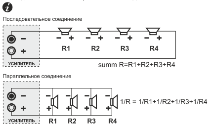
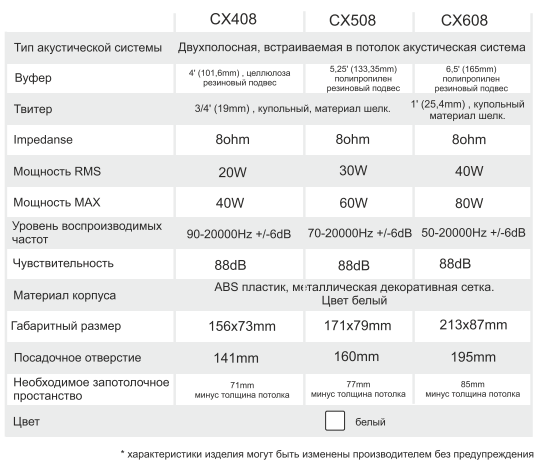

#CVGaudio CX408

##Оглавление
1. [Описание](#описание)
2. [Установка](#установка)
3. [Подключение](#подключение)
4. [Гарантийные обязательства](#гарантийные_обязательства)
5. [Технические характеристики](#технические_характеристики)
6. [Габаритные размеры и чертеж](#Габаритные_размеры_и_чертеж)

В комплект поставки акустической системы входит:
- встраиваемая акустическая система CVGaudio СХ4/5/б
- декоративная металлическая защитная сетка для внешней установки
(безрамочный корпус)
- декоративная металлическая защитная сетка для внешней установки
(корпус акустической системы с видимым пластиковым кантом)
- картонный шаблон для разметки отверстия под установку

Упаковка:
В одной внутренней (цветной) коробке поставляется две акустических
системы CVGaudio СХ4/5/6. Одна внешняя (одноцветная коробка)
содержит восемь акустических систем CVGaudio СХ4/5/6.

##Описание 

CVGaudio СХ series - двухполосные. встраиваемые в потолок
акустические системы Hi-Fi класса. Предназначены в основном
для использования в бюджетных системах фонового озвучи вания
и мультирум звуковых системах установленных в частных
апартаментах, гостиничных номерах, коттеджах, квартирах,
офисных кабинетах, небольших переговорных и так далее.
Ключевой отличительной особенностью данной серии является
наличие в комплекте поставки акустических систем СХ двух
вариантов декоративной защитной сетки. Они отличаются тем,
что при установке корпус акустики или полностью скрыт
абсолютно безрамочной сеткой или при использовании второго
варианта - имеет элегантный плГстиковый бортик шириной 1 Омм,
В первом варианте сетка держится с помощью надежных
неодимовых магнитов, во втором вставляется в специальный паз
в корпусе, Благодаря такому универсальному решению
акустические системы CVGaudi0 CR можно идеально вписать в
лю&й интерьер, не нарушив общий стиль помещения и
оставаясь фактически незаметными из-за полного отсутствия
пластиковых рамок на декоративной сетке,
Серия СХ состоит из трех моделей - 6“, по размеру вуфера .
В моделе СХ4О8 4“ вуфер ИЗГОТОВЛен из целулозы, 3,4” твиттер из
шелка. Модель СХ5О8 имеет 5“ вуфер из полипропилена и 3/4“
твиттер из шелка. Самая крупная модель данной серии имеет
размер вуфера 6” (материал полипропилен) и 1 * шелковый
твиттер, CVGaudio Сх4О8 и CR508 в основном рекомендуется
использовать в небольших помещениях с не высоким потолком -
коридоры, прихожие, санузлы, гардеробные и так далее.
CVGaudio СХ608 в силу уже более большого размера вуфера и
как следствие большей мощности и более низкочастотного
звучания можно использовать в комнатах, гостинных. залах и так
далее. Рекомендованная высота потолка - до 4-х (тах - 4,5)
метра. Акустические системы серии СХ штатно изготавливаются
только белого цвета, но при необходимости как сетка, так и корпус
без проблем могут быть окрашены в любой необходимый цвет
Импеданс всех моделей серии СХ - 80hm. Мощность (RMS) - 4“ -
20Wl 5'-30W/6“-40W.
В целом акустические системы CVGaudi0 серии СХ имеют
сбалансированное, комфортное звучание и отлично справятся с
созданием приятного музыкального в интерьерах, где не
требуется высокая громкость воспроизведения ,

##Установка 

Акустические системы CVGaudio серии СХ предназначены для
установки в подвесной потолок или фальшь-стену толщиной от 8-
ми до ЗОмм. Для монтажа необходимо наличие внутренней
полости размером не менее:
CVGaudio СХ4О8 - min 71 тт
CVGaudio СХ5О8 - min 77 тт
CVGaudio СХбО8 - 85тт
Перед установкой необходимо подготовить отверстие в потолоке
или стене. Размер отверстия для разных моделей серии СХ будет
различным:
CVGaudioCX408-141mm
CVGaudio СХ508 - 16Отт
CVGaudio сход -195тт
К каждой акустической системе прикладывается специальный
картонный шаблон для разметки отверстий. Приложите его к
месту предполагаемой установки и обведите по контуру
карандашом. Далее с помощью пилы необходимо вырезать
размеченное отверстие .
Спикерный кабель приходящий от усилителя подключается к
акустической системе с помощью самозажимного кабельного
терминала. Максимальное сечение кабеля которое можно зажать
в данном типе терминала - 2х2,5тт. Зачистите 5mm изоляции на
каждой жиле приходящего спикерного кабеля . Нажмите на
терминал, подпружиненная верхняя часть опустится вниз и
откроет отверстие для кабеля поместите в отверстие кабель,
отпустите терминал. Подпружиненная часть разъема поднимется
вверх и зафиксирует кабель в терминале. Далее проделайте туже
процедуру со второй жилой приходящего кабеля.
После того, как акустическая система подключена, снимите
декоративную металлическую сетку с лицевой стороны корпуса,
далее поместите поворотные кронштейны расположенные с
задней стороны корпуса в крайнее левое положение С помощью
отвертки или шуруповерта закрутите с лицевой стороны
крепежные саморезы фиксирующие кронштейн до такой степени ,
чтобы поворотная часть свободно вращалась, но не имела
большого хода по вертикальной оси. После этого поместите
корпус в установочное отверстие в потолке. Придерживая одной
рукой корпус акустической системы (не держите корпус за твиттер
- это может нарушить его позиционирование) затяните саморезы
по часовой стрелке. При вращении самореза кронштейн
провернется по часовой стрелке и далее начнет опускаться вниз
таким образом притягивая лицевую часть корпуса акустической
системы к наружней плоскости ПОТОЛКа. Поле того, как корпус
будет зафиксирован в установочном отверстии верните ан место
декоративную сетку закрывающую диффузор, В комплекте
поставки каждой акустической системы серии СХ имеется две
декоративных сетки - безрамочная (полностью скрывающая
корпус динамика) и второй вариант меньшего размера (при
установке этой сетки остается видна рамка корпуса шириной
приблизительно 1 Отт

##Подключение 

Акустические системы серии СХ имеют сопротивление 80hm и
работают совместно с низкоомными усилителями. Данные
усилителя в зависимости от модели работают С нагрузкой от 4-х
до 160hm. Таким образом суммарное сопротивление
акустических систем подключенных к каналу усилителя должно
быть в пределах корректного для его работы диапазона, Данная
информация всегда есть на документации к любому усилителю.
Если Вам требуется подключить к каждому из каналов усилителя
больше чем по одному динамику, то необходимо использовать
последовательное или па аллельное соединение:

При необходимости можно использовать последовательно -
параллельное соединение. При подключении акустических
систем к усилителю соблюдайте полярность, Плюс на кабельном
терминале имеет красную отметку.

##Гарантийные обязательства 

При условии соблюдения описанных выше правил установки,
подключения и эксплуатации на все акустические системы призводства
компании CVGaudio предоставляется гарантийный срк бесплатного
сервисного обслуживания 2 года. Адрес сервисного центра Вы можете
найти на web сайте компании CVGaudi0 - www.cvg.ru, или обратится к
региональному дилеру у которого Вы приобрели данное оборудование.
Подтверждающим документом для осуществления гарантийных
обязательств является накладная на приобретение товара с печатью
торговой организации, где Вы приобрели данное изделие.

##Технические характеристики 

##Габаритные размеры и чертеж 

<body>
    <h2>HI GEEKSFORGEEKS USER'S</h2>
    <form>
        <input type="button" value="Print"
               onclick="window.print()" />
    </form>
</body>