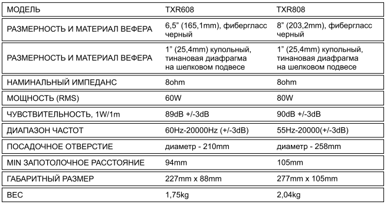
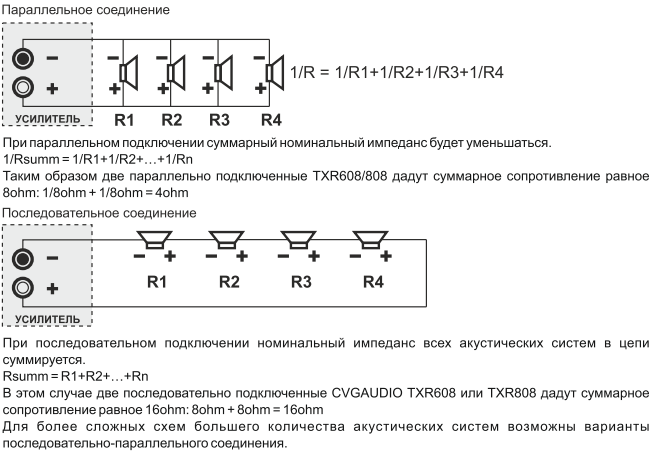

#CVGaudio TXR608

##Оглавление
1. [Гарантийные обязательства](#Гарантийные_обязательства)
2. [Технические характеристики](#Технические_характеристики)
3. [Общая информация](#Общая_информация)
4. [Установка](#Установка)
5. [Подключение](#Подключение)

##Гарантийные обязательства 

При соблюдении условий эксплуатации и правил установки на все акустические системы производства
компании CVGAUDlO предоставляется гарантийное обслуживание сроком на 2 года. В
случае выхода устройства из строя — просьба обратиться к региональному дилеру компании CVGAUDjO
или в головной офис в Москве. Контакты офиса и сервисных центров Вы можете найти на нашем сайте
www.cvg.ru в разделе КОНТАКТЫ.

##Технические характеристики 

##Общая информация 

CVGAUOlO TXR — серия высококачественных встраиваемых в потолок двухполосных акустических
систем Hi-Fi класса для домашних и про4нхиональных систем комфртного фонового звука и систем
домашнего кинотеатра. Акустические системы серии TXR работают только в Iow-impedance
(классическом для домашнего аудио) формате и имеют номинальный импеданс 80hm„ В серию входит
две модели — CVGAUDlO TXR608 и TXR808, по размеру вуфра 6.5“ и 8“ (размерность в дюймах). RMS
мощность TXR608 — 60W, TXR808 — 80W. Этого С большим запасом достаточно для встраиваемых
акустических систем как при домашнем использовании в частных апартаментах, квартирах, коттеджах и
виллах, так и при профессиональном использования в система коммерческого аудио устанавливаемых в
бутиках, кафе, ресторанах, сна, офисах и комференц-румах, При создании акустических систем (*рии
TXR используются только выстокачественные компоненты. Вуфер изготавливается из очень прочной и
при этом необычайно легкой карбоновой стреклоткани (практически идеального материала для
акустики), крупный купольный 1' твитер сделан из титановой мембраны, установленной на шелковый
подвес. Для распределения частот используется продвинутый, специально разработанный для данной
серии кроссювер второго порядка с возможность управления уровнем громкости тритера относительно
вуфера (-3dB 0dB +3dB). Благодаря всем перечисленным выше достоинствам обе модели акустических
систем CVGAUDtO серии ТХ имею очень комфортное, звучание с яркими высокими
частотами и глубоким качающим басом. Дополнительной “изюминкой" TXR является использование
лицевой декоративной металлической сетки с очень тонкой пластиковой рамкой (2мм). Это придает
элегантности смонтированной в потолок акустической системе и позволяет гармонично вписать ее в
любой интерьер. Помимо этого, с обратной сетки вклеена специальная акустически прозрачная
ткать. Благодаря этому через с»тку совершенно не заметны внутренние компоненты. Сетка со стороны
слушателя имеет равномерный, без градиентов и просвечивающих частей корпуса, &лый цвет. Все это
безусловно очень важно при использовании встраиваемой акустически в частных апартаментах, где
пристрастное отношение к внешнему виду и дизайну имеет обостренный характер. Декоративная
металлическая сетка фиксируется на очень надежных и долговечных магнитах, встроенных
в корпус акустической системы. Сам корпус с очень индивидуальной, футуристической лицевой панелью
изготовлен из черного ABS пластика. При фиксации лицевой декоративной сетки на установленную в
потолок акустическую систему, корпус АС будет полностью скрыт.

##Установка 

для установки встраиваемой акустики в первую очередь необходимо подготовить отверстия в подвесном
потолке. Материал потолка должен обеспечить достаточную плотность и толщину для корректной
установки, Минимальная толщина подвесного потолка для надежной фиксации корпуса — 8тт,
Материал — гипсокартон, фанера, листовой пластик дстаточной толщины и так далее. Допустима
установка в потолок типа “Armstrong" но только в варианты достаточной толщины и из плотных
материалов. В противном случае необходимо использование опциональных запотолочных укрепляющих
вкладышей. Размер отверстия под установку для модели CVGAUDIO TXR608 — 210тт и для модели
TXR808 — 258mm, После того, как Вы подготовили отверстия и сделали кабельную разводку (подробно
подключение будет описано в следующем разделе) необходимо установить динамики. Снимите
защитную сетку с лицевой стороны корпуса. Каждая акустическая система серии TXR имеет по
поворотных кронштена, Кронштейны фиксируются с помощью винтов на лицевой стороне корпуса.
Ослабьте винты так, чтобы кронштейны могли спокой проворачивать и установите их в крайнее
положении при вращении по часовой стрелке. далее подключите приходящие акустические кабели к
самозажимному кабельному терминалу на задней стороне корпуса акустической системы. Строго
соблюдайте полярность при подключении. После того как Вы подключили АС к спикерной линии
поместите корпус в в потолке, Затем с помощью отвертки или шуруповерта (что будет гораздо
удсбнее) последовательно затените все четыре крепежных винта. В процессе закручивания каждого из
винтов связанные кронштейны буду опускаться с обратной стороны потолка и в итоге прижмутся к
внутренней стороне подвесного потолка благодаря чему надежно зафиксируют корпус АС в отверстии.
Как отмечалось выше у каждой АС серии TXR имеется трехпозиционный селектор, который управляем
громкостью твитера относительно вуфера с шагом 3dB. Перед тем как установить внешнюю
декоративкую сетку — выставьте селектор в положение соответствующее наиболее комфортному звуку.

##Подключение 

Подключение приходящего от усилителя спикерного кабеля в акустических системах TXR реализовано с
помощью специальных самозажимных кабельных терминалов. Зачистите от изоляции концы
приходящего спикерного приблизительно на 8-1 Отт. Кабельные зажимы имеют красно-чёрную
маркировку. Красная чёрная При подключении необходимо строго соблюдать полярность. Контакт
усилителя (+) должен быть ПОДКЛЮЧЁН к контакту (+/красному) акустической системы, контакт
соответственно к контакту (-/чёрному) акустической системы. Для подключения кабеля нажмите на
верхнюю подвижную часть терминала, в открывшееся сбоку отверстие поместите зачищенную часть
приходящего кабеля и затем отпустите кабельный зажим . Подпружиненная часть терминала поднимется
вверх и надежно зафиксирует кабельную жилу, Аналогично подключите вторую жилу спикерного кабеля к
терминалу соответствующей ПОЛЯРНОСТИ. В НИЗКООМНЬје (low-impedance) системах к которым
принадлежит серия акустических систем TXR основным правилом которое необходимо соблюдать
является при подключении - суммарный номинальный импеданс нагрузки акустических систем должен
быть в корректном для усилителя Для большинства low-impedance усилителей корректный
диапазон нагрузки 4-80hm, для некоторых усилителей нижний диапазон может быть 20hm, а верхний
160hm. Критичным является нижний порог — подключение меньшей нагрузки может вывести усилитель из
строя. Номинальный импеданс одной акустической системы TXR - 80hm. При подключении по одной
акустической системе на канал — эта нагрузка будет корректной для любого Low-impedance усилителя.
Если в Вашем проекте необходимо подключить несколько акустических систем на канал усилителя, то
возможныдвава иантакомм ации—лоследовательное подключение ипа аллельное подключение.

<body>
    <h2>HI GEEKSFORGEEKS USER'S</h2>
    <form>
        <input type="button" value="Print"
               onclick="window.print()" />
    </form>
</body>