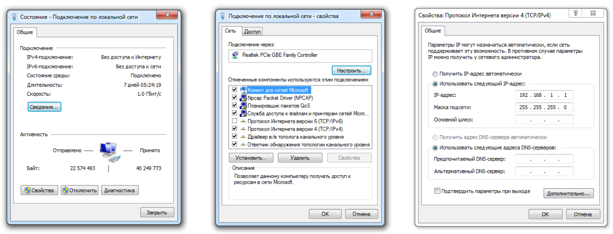

#Unicore DX

##Подключение и использование

# Table of Contents
1. [Example](#example)
2. [Example2](#example2)
3. [Third Example](#third-example)
4. [Fourth Example](#fourth-example)

## Example
## Example2
## Third Example
### [Fourth Example](https://www.cvg.ru/catalog/products/unicore/) 

CVGAUDIO UNICORE DX устанавливается на DIN рейку. В комплект поставки не входит блок питания. Рекомендуем использовать блок питания для установки на DIN-рейку 12V/2A. Подключение 
всех интерфейсных кабелей происходит через коннекторы с зажимом под винт.

CVGAUDIO UNICORE DX имеет габариты 90mm x 212mm x 58mm и предполагает монтаж на DIN 
рейку – корпус выполнен со всеми необходимыми защёлками. В стойке прибор займет всего 12U. 
CVGADUIO UNICORE DX может быть использован как самостоятельный контроллер или как расширитель интерфейсов для других контроллеров. Также можно объединять неограниченное количество UNICORE DX посредством подключения в одну локальную сеть.

##Первое включение

Перед началом использования необходимо подключить UNICORE DX к Вашей локальной компьютерной сети или напрямую к управляющему компьютеру. Для подключения потребуется стандартный, одинаково обжатый с двух сторон, патч-корд 8P8C (не входит в стандартный комплект поставки). Далее необходимо организовать электропитание прибора с помощью блока питания 12В 2А (не входит в стандартный комплект поставки). Как было описано выше необходимо подключить блок питания к винтовым клеммам (7) соблюдая полярность.

При подаче питания на прибор автоматически будут отработаны сценарии прописанные на данное событие и активируется светодиодная индикация на лицевой панели устройства. Ключевой индикатор информирующий о состоянии и режиме работы UNICORE DX - это STATUS. В штатном режиме работы индикатор STATUS мигает красным примерно раз в секунду. Остальные 16 красных индикаторов на лицевой панели, как было описано выше, информируют о том активен тот или иной порт устройства и в каком состоянии находятся логические контакты.

Для доступа к веб-интерфейсу управления и программирования CVGAUDIO UNICORE DX необходимо чтобы управляющий компьютер и UNICORE DX находились в одной подсети. По умолчанию IP адрес UNICORE DX - 192.168.1.6. Таким образом компьютер с которого вы будете заходить на веб-интерфейс UNICORE DX должен иметь IP - 192.168.1.«значение отличное от «6». Чтобы проверить и при необходимости изменить IP адрес Вашего компьютера необходимо зайти в раздел Центр Управления сетями и общим доступом и далее выбрать Соединение по локальной сети. В открывшемся окне нажмите СВОЙСТВА и далее в следующем окне выберете - Протокол Интернета версии 4 (TCP/IPv4). После этого станет доступна еще одна кнопка СВОЙСТВА. После ее нажатия откроется 
следующее окно, в котором вы сможете установить необходимый Вам IP адреса и способ его получения. Для того чтобы вы могли изменить IP необходимо выбрать - Использовать Следующий IP адрес. Далее задайте любой свободный IP в одной подсети с CVGUDIO UNICORE DX (192.168.1.6), например, 192.168.1.2, если он не занят другими устройствами.

Адрес DNS сервера в данном случае для нас не имеет значения и можно эту настройку пропустить. Далее нажмите кнопку OK и закройте все окна настройки сетевых подключений. После этого запустите браузер, рекомендуем использовать FireFox или CHROME, они обеспечат более корректное отображение веб-интерфейса UNICORE DX. В адресной строке браузера введите IP UNICORE DX, по умолчанию 192.168.1.6. Если вы все сделали правильно, то вы увидите предупреждение о том, 
что интерфейс загружается.

##Базовые настройки веб-интерфейса

После того, как Вам стал доступен интерфейс управления устройством в первую очередь необходимо настроить сетевое подключение. Для изменения IP адреса необходимо зайти в раздел SETTING / NETWORK SETTING. Здесь вы сможете прописать новый IP для Вашего CVGAUDIO UNICORE DX.

IP ADDRESS - адрес UNICORE DX в сети. По умолчанию, для удобства обнаружения прибора, адрес не выдается автоматически по DHCP, он должен быть прописан вручную и находится в одной подсети с компьютерами с которых будет осуществляться управление устройством.
NETMASK - маска подсети, по умолчанию - 255.255.255.0
GATEWAY - адрес сетевого шлюза (маршрутизатора, роутера…) в вашей сети
MAC ADDRESS - мак адрес UNICORE DX
Обратите внимание, что у всех UNICORE DX по умолчанию одинаковый MAC адрес: 00-04-A3-22-86-76. В одной сети не может быть несколько устройств с одинаковым MAC адресом, поэтому если вы используете несколько UNICORE DX - необходимо прописать различные MAC адреса для всех Ваших UNICORE DX. Если вы используете другие сетевые устройства CVGAUDIO серии DIGA - также проверьте чтобы MAC адреса у всех устройств были различные.

Все остальные сетевые настройки при первом включении Вам не потребуются и к ним мы вернемся позднее. После того, как вы внесли все необходимые изменения - нажмите кнопку SAVE CHANGES в конце раздела. После этого необходимо перезапустить процессор. Для этого прокрутите интерфейс вверх и нажмите кнопку SYSTEM REBOOT. Без этого изменения не будут сохранены. Приблизительно через 10 секунд вы сможете увидеть CVGAUDIO UNICORE DX уже по новому адресу.

<body>
    <h2>HI GEEKSFORGEEKS USER'S</h2>
    <form>
        <input type="button" value="Print"
               onclick="window.print()" />
    </form>
</body>